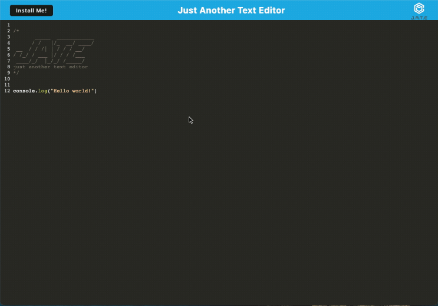

# PWA_Text_Editor

## Table of Contents
- [Description](#description)
- [Installation](#installation)
- [Usage](#usage)
- [Contributing](#contributing)
- [Tests](#tests)
- [Questions](#questions)
- [License](#license)

## Description

Embark on a dynamic learning journey as you tackle the creation of a Progressive Web Application (PWA) Text Editor in this advanced course project. Seamlessly fusing the principles of responsive design and offline functionality. Through skillful implementation of data persistence techniques and the integration of the idb package for IndexedDB database management, this project not only showcases prowess in modern web development but also stands as a testament to the ability to craft robust and engaging user experiences that transcend online limitations.

## Installation

First, search for repository on Github called PWA_Text_Editor. Then, on the top-right corner, click 'Code' and copy the link. Afterwards, go to VSCode and open the local terminal from the desired parent repostory where you desire to install the PWA_Text_Editor. Then, write 'git clone (paste link here)'. Finally, you'll notice the repository has been installed for your convenience. Also, download the proper dependencies (npm i). Lastly, for the app to start compiling and the server to run, write on the terminal "npm run start" and if successful, you'll be able to run the app on localhost:3000 on your browser. Before making any changes, make sure that the propper dependencies have been downloaded to prevent bugs or functionality issues.

## Usage
This versatile text editor will be accessible directly from web browsers, enabling users to compose and edit text seamlessly across devices. With a focus on responsive design, the text editor guarantees a consistent experience on various screen sizes. Just click Install on the top and you will be prompted to download the application.

## Contributing

If you would like to contribute as a developer, you can submit a pull request. Before starting any substantial work, it's recommended to open an issue to discuss your proposed changes with the lead developer.

# Screenshots

## Next screenshots will create understanding of the website's functionality.
# a. Homescreen   
# b. idb-Storage   
# c. Manifest file   
# d. Service-Worker   

 
 
## Refferences

1. <a href = https://www.w3schools.com/>W3Schools</a>

2. <a href = https://stackoverflow.com/>Community Forums & Stack Overflow</a>

3. <a href = https://coding-boot-camp.github.io/full-stack/heroku/heroku-deployment-guide>Heroku Deployment</a>

4. Progressive Web Apps in 100 Seconds // Build a PWA from Scratch: https://www.youtube.com/watch?v=sFsRylCQblw 

5. <a href = https://developer.mozilla.org/en-US/docs/Glossary/MVC>MDN Web Docs</a>

6. PWA Tutorial for Beginners #1 - What Are PWA's: https://www.youtube.com/watch?v=4XT23X0Fjfk&list=PL4cUxeGkcC9gTxqJBcDmoi5Q2pzDusSL7  

## Heroku Link
https://pwajate-text-editor-64e0b83af6c5.herokuapp.com/

## Github Repository
https://github.com/QuitoMusic/PWA_Text_Editor

## Questions

For any questions, please contact us:

- GitHub: [QuitoMusic](https://github.com/QuitoMusic)

## License

This project is licensed under the MIT License.